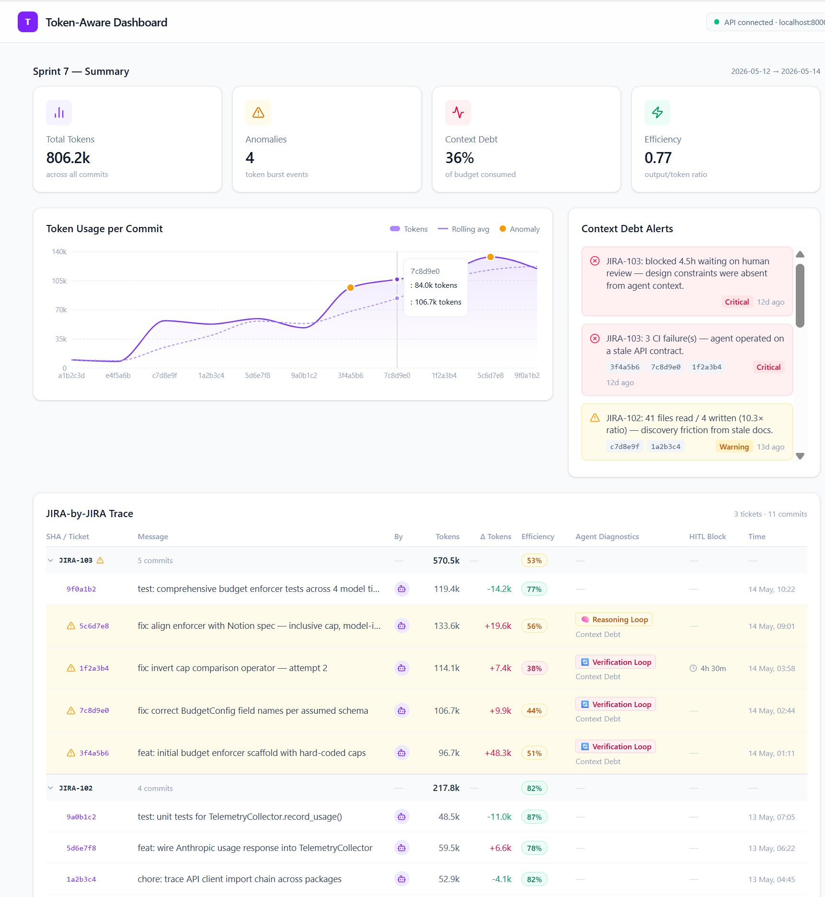

# Token-Aware Traceability Dashboard

A next-generation engineering telemetry system designed to monitor, audit, and optimize AI developer agent performance and model inference budgets.

## Why This Project Exists
As engineering teams transition from human-only development to hybrid workflows—where autonomous AI agents (like Claude Code) write, test, and commit code directly—traditional project management metrics like "Story Points" fall short. 

AI agents do not get tired, but they can get stuck. An agent trying to resolve a complex bug or navigating a disorganized codebase can fall into recursive reasoning loops, burning through millions of tokens and hundreds of dollars in API costs in a single hour. 

This project provides a **Token-Aware Dashboard** that treats LLM tokens as a direct infrastructure expenditure (Capital Expense). It monitors repository traffic in real time to ensure AI agents operate with maximum clarity, efficiency, and cost-predictability.

---

  
   
  <em>Figure 1: Telemetry Console Overview – Tracking token expenditure, dynamic loop anomalies, and engineering efficiency metrics.</em>

---

## Core Features & Business Value

### 📊 1. Real-Time Token Expenditure Tracking
Monitors the exact volume of input and output tokens consumed across every automated engineering task. It replaces guessing with real line-item inference metrics, acting as a "Cloud Bill" monitor for your AI tools.

### ⚠️ 2. Automated Context Debt & Anomaly Detection
Flags "Token Burst Events" (Anomalies) in real time. If an agent gets stuck in a loop trying to solve a bug or interpreting an outdated requirement document, the dashboard flags the event in amber/red so managers can intervene before costs bleed out.

### ⚙️ 3. Human-in-the-Loop (HITL) Friction Auditing
Tracks exactly when and for how long a human engineer had to step in to unblock an autonomous agent. Measuring this manual friction provides immediate insights into how autonomous your development lifecycle truly is.

### 📈 4. Structural Engineering Efficiency Metrics
Calculates an "Efficiency Score" for every code commit. Instead of just counting raw lines of text, it evaluates how much *useful, functional code* was delivered relative to the volume of tokens paid for, penalizing sloppy or over-complicated code logic.

---

## Intended Audience
* **Technical Program Managers (TPMs) & Engineering Leaders:** To govern AI agent budgets, track operational efficiency, and prioritize repository maintenance based on financial data.
* **FinOps Teams:** To categorize, audit, and predict model inference expenses alongside standard AWS/Azure cloud spend.
* **Software Engineers:** To locate and clean up sections of the codebase that are causing AI tools to struggle or fail.